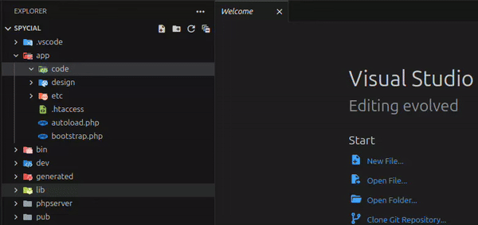

# MagentoDev

Make vscode a better IDE for Magento 2

This extension aim to make vscode the best IDE for Magento 2 development by adding the most time saving features.

## Features

### Automatic module creation

When you create a new valid extension folder in the `app/code` folder, the extension will automatically create the necessary files with the default content.

### Default content for new files

When you create a new file in the `app/code` folder, the extension will automatically add the default content for the file type.

The following file types are supported:
- `registration.php`
- `etc/di.xml`
- `etc/module.xml`
- `Block/**.php`
- `Controller/**.php`

### Override view file

You can now override a view file in a specific theme by right clicking on the file in the explorer and selecting the `MagentoDev: Override in theme` option.

## TODO List

- [x] Automatic module creation when a valid folder is created.
- [x] Context menu option in the explorer to override a view file in a specific theme.
- [ ] Auto clean cache index when needed. (like magento cache clean)
- [ ] Auto remove generated files when needed.
- [ ] Dynamic default content for new files.
    - [x] registration.php
    - [x] di.xml
    - [x] layout.xml
    - [x] Block.php
    - [x] Controller.php
    - [x] events.xml
    - [x] Observer.php
    - [ ] db_schema.xml
    - [ ] routes.xml
    - [ ] webapi.xml
    - [ ] system.xml
    - [ ] acl.xml
    - [ ] menu.xml
    - [ ] widget.xml
    - [ ] cron_group.xml
    - [ ] crontab.xml
    - [ ] email_templates.xml
    - [ ] template.phtml
- [x] Snippets for common code blocks.
    - [x] di.preference
    - [x] di.type
    - [x] di.virtualType
    - [x] di.plugin
    - [x] di.arguments
    - [x] events.event
    - [x] layout.container.open-close
    - [x] layout.container.self-closing
    - [x] layout.block.open-close
    - [x] layout.block.self-closing
    - [x] layout.referenceContainer.open-close
    - [x] layout.referenceContainer.self-closing
    - [x] layout.referenceBlock.open-close
    - [x] layout.referenceBlock.self-closing
    - [x] layout.remove
    - [x] layout.move
    - [x] layout.update
- [ ] Commands
    - [x] Re-index all indexes
    - [ ] Create a new module
- [ ] Extension translation
    - [x] English
    - [ ] French
    - [ ] Spanish
    - [ ] German
